     If you want to search or if u want to get then it is very fast/easy in Array or ArrayList we can do using Index.
     Time Complexity - O(1) using Index
     Problem is - Array is Static in Nature so we can use Arraylist.
                  If you are using a big array and that array not filled with all elements then you are wasting memory.
                  Adding or deleting the value from starting position is easy you can do it but if u are deleting from mid it will do shifting.
     Drawback - Array is not good if you are inserting a value or expanding or for deletion bcz you need to do shifting of elements.
     Resolve -  This is the Reason Linked List come in to picture while we are deleting or Adding elements in mid/start/end.

    

Linked List
===========

    In LinkedList we don't store the value in sequence. 

    let's say i want to store 5, 8, 1, 3 into a linked list.

    In LL we are having a Nodes, a Node contains Data and Reference address of next element.

    we are storing all the values in Nodes but the problem is how are you going to maintain the sequence. bcz they are store somewhere
    they are not in a sequenced memory. bcz in array you use Index value. the address of an array represents the address of 1st index element
    If you want to get the next element so 101+1....

    Ofcourse all the nodes is having it's own memory address. but if u know the address u can find it.
    so it's called linked list bcz we have a list of values and all are linked with ref link.

    

   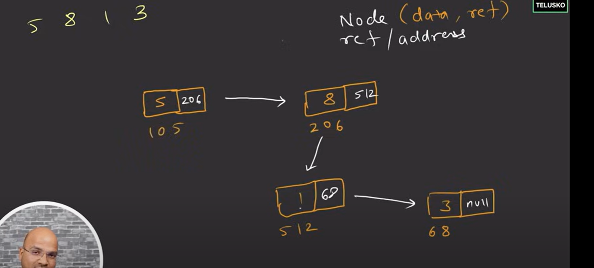

   

   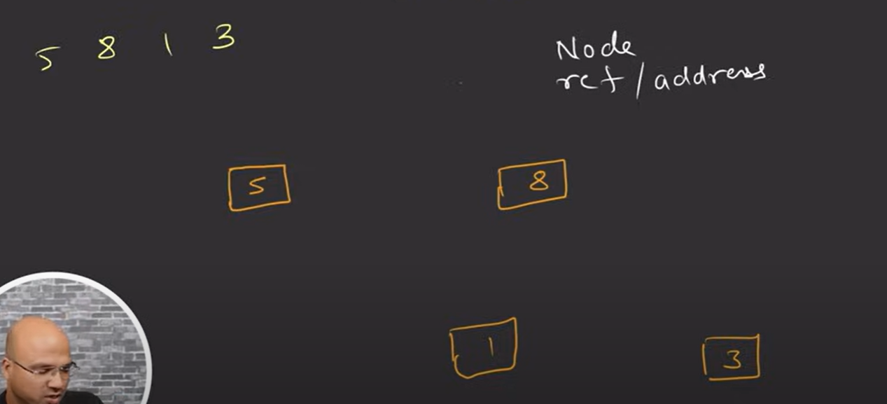

       

    It's called a linked list bcz we have a list of values and all are linked. they are linked with the address of their reference.

  
   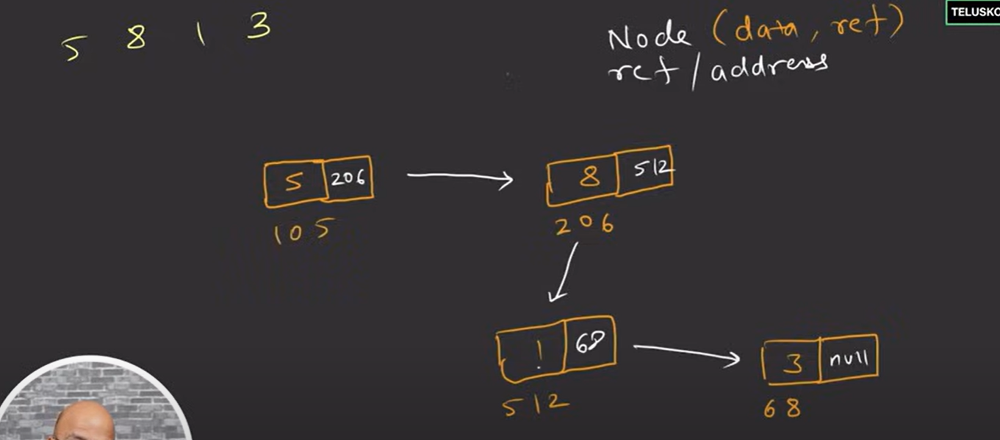

    now nodes are in a list 5, 8, 1, 3
    we want to insert new node with data 6

   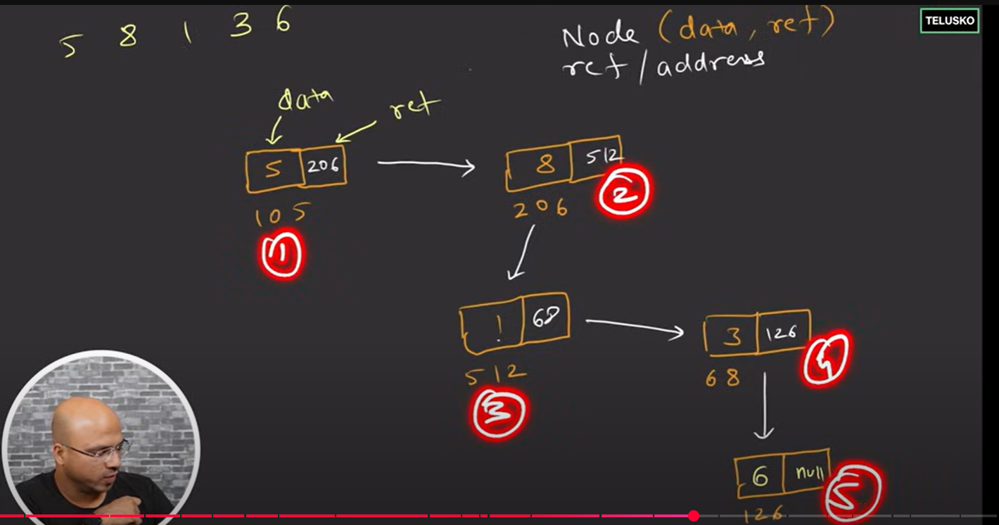

 
 Head
=======

  => How will you know that which is the First Element and from where you are going to start traversing???

  => We should have one more concept Head.

  => Every Linked List is Having a Head Node which will point to the first Node of a Linked List.

  => you should have an extra variable which will pointing to the first node.

  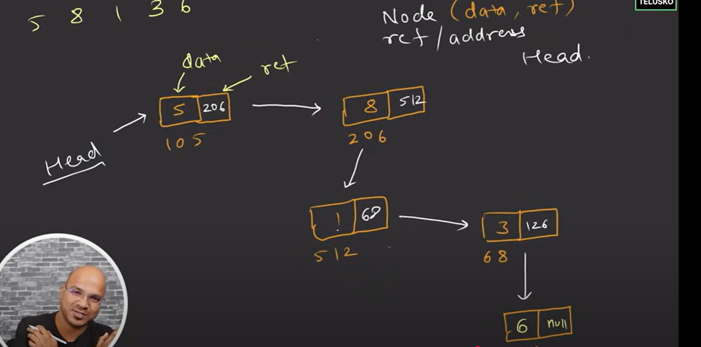

  => what will you do If you want to insert an element in between so in array you actually shift the variables and it's a time consuming process.

 steps: To insert 1 value in between Linked List
        ----------------------------------------
         
   
   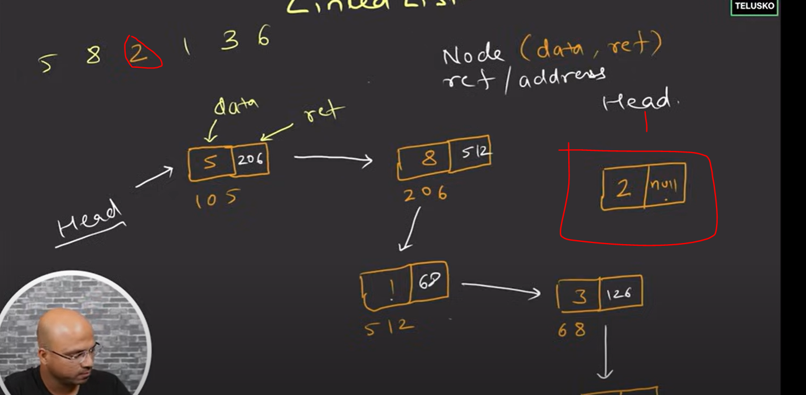
   
      let's say you want to insert 2 in between 8 and 1.
      you are creating a new Node with data 2 and by default reference will be null as always.
      this node should come between 8 and 1.
      Linked lIst also follows Insertion orders.
   
   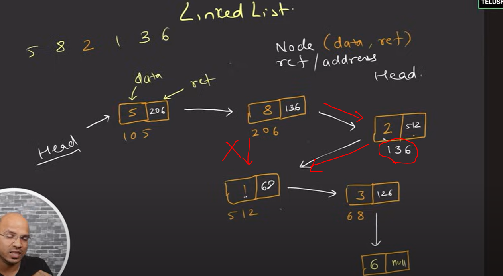

   this is Singly Linked List - It will go in a single way.

   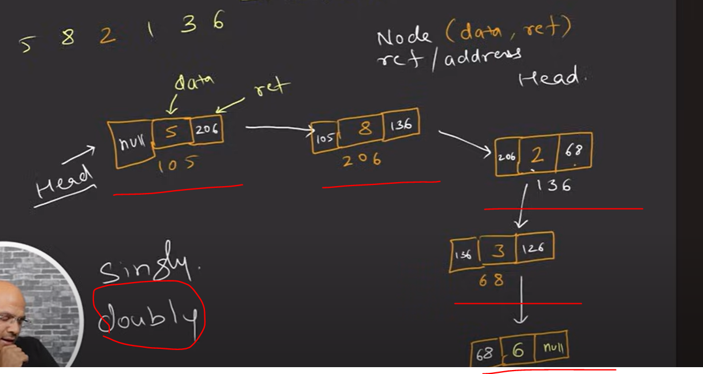

   

  Coding - Implementation
============================

  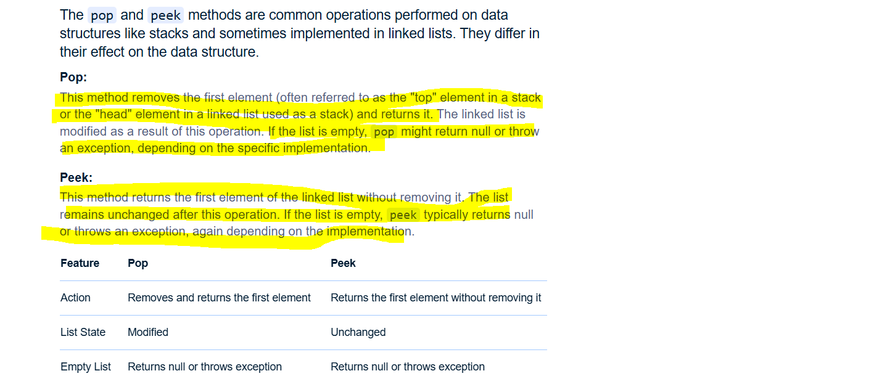

  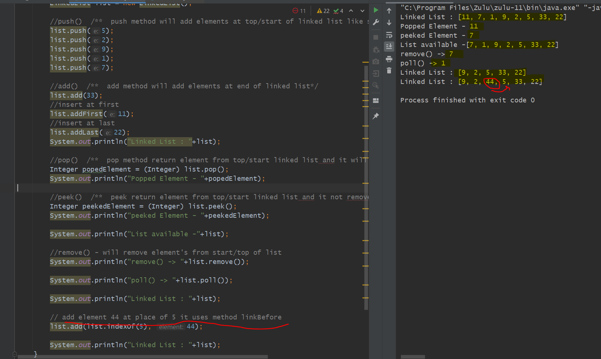

  
Main Class
----------

 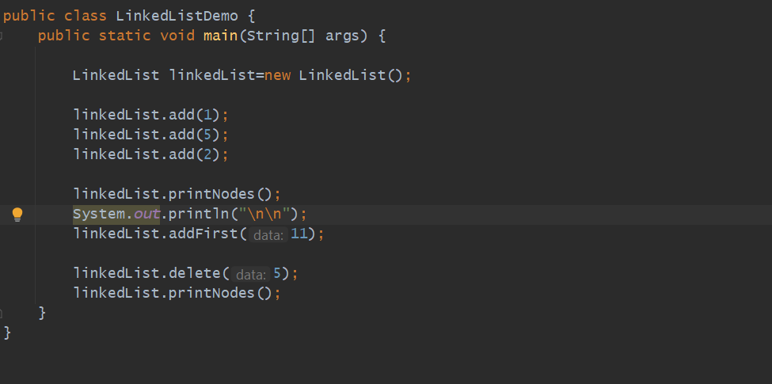

Output Console
--------------

 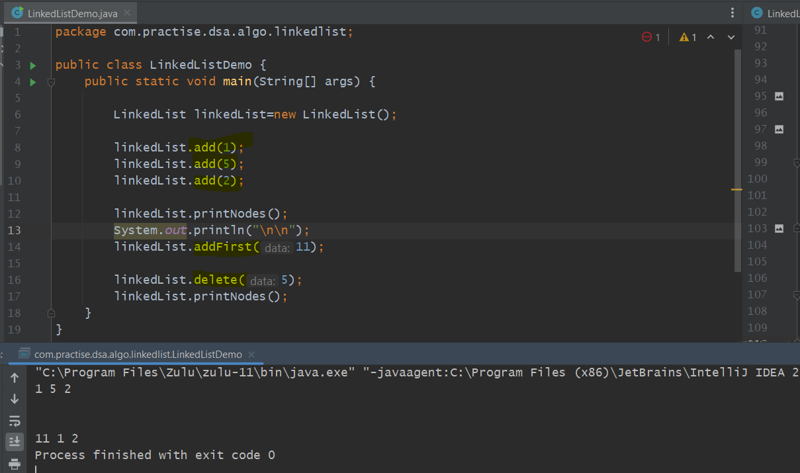

Node Creation
-------------

 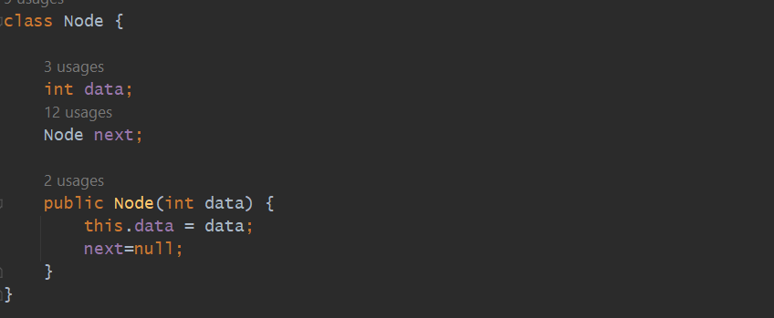

Add Element in a Linked List
----------------------------

 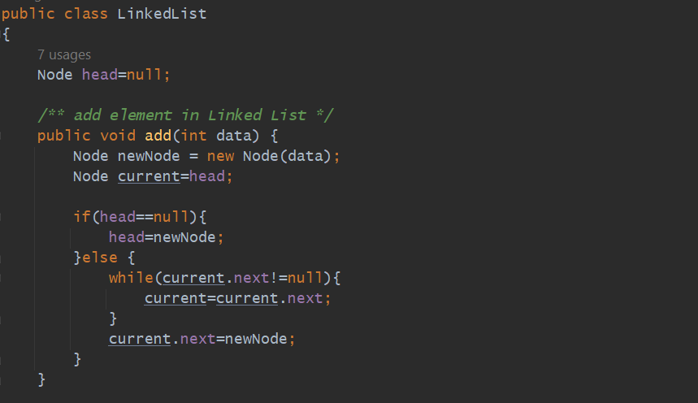

Print Elements of a given Linked List
-------------------------------------

 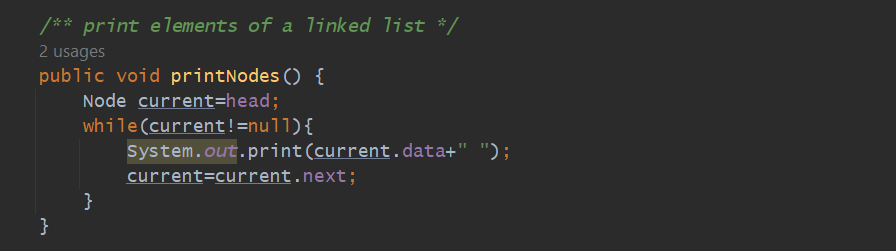

Add Element at First Place
--------------------------

 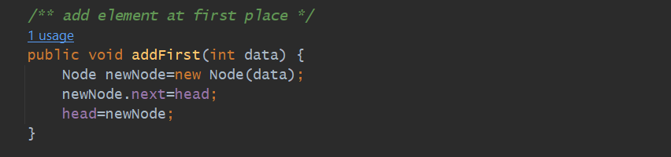

Delete Element's from a List
----------------------------

 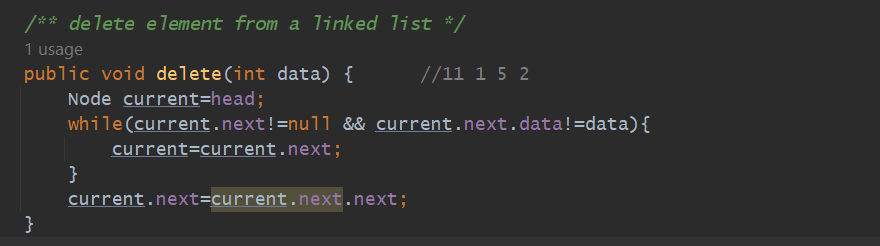

    class Node {
       int data;
       Node next;

       public Node(int data) {
          this.data = data;
          next=null;
       }
    }

    public class LinkedList
    {
       Node head=null;

    /** add element in Linked List */
    public void add(int data) {
        Node newNode = new Node(data);
        Node current=head;

        if(head==null){
            head=newNode;
        }else {
            while(current.next!=null){
                current=current.next;
            }
            current.next=newNode;
        }
    }

    /** print elements of a linked list */
    public void printNodes() {
        Node current=head;
        while(current!=null){
            System.out.print(current.data+" ");
            current=current.next;
        }
    }

    /** add element at first place */
    public void addFirst(int data) {
        Node newNode=new Node(data);
        newNode.next=head;
        head=newNode;
    }

    /** delete element from a linked list */
    public void delete(int data) {      //11 1 5 2
        Node current=head;
        while(current.next!=null && current.next.data!=data){
            current=current.next;
        }
        current.next=current.next.next;
    }}

  