In Real worlds we are using multiple sorting technique in our day-to-day life. like while we do shopping on amazon

we add our items in a cart so, it will sort by pricing or sorting by a reviews and all. so sorting is used majorly.

Some Algorithms are Simple and Easy to understand but, they are time efficient. some algos are more efficient but
they are not easy to understand. 

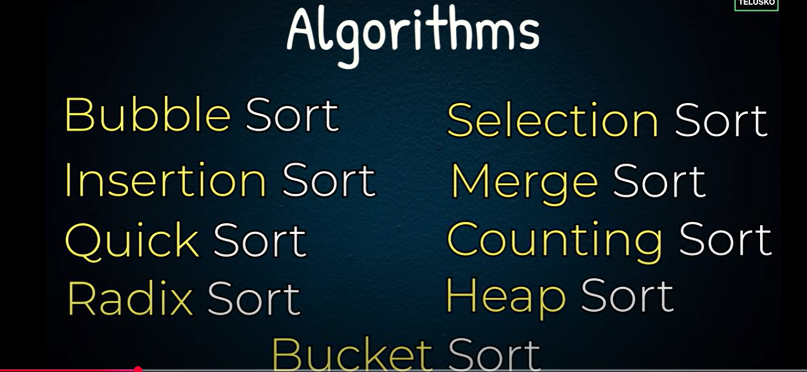

Bubble Sort
============

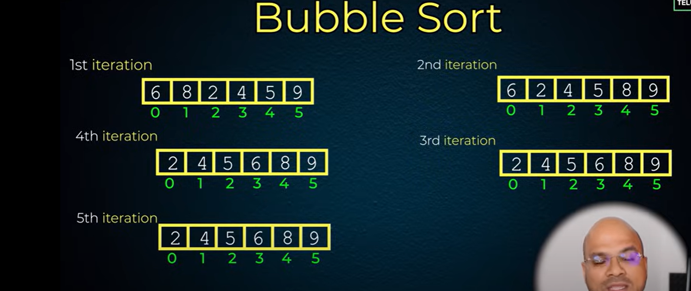

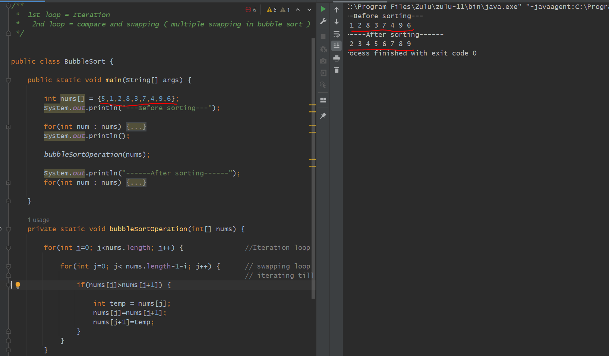

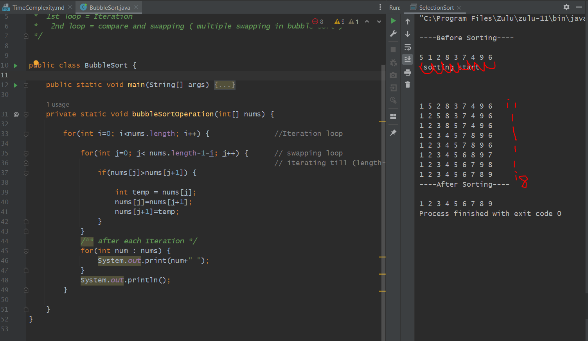

** when no. of Elements - 9
   No. of Iteration -> 8
   No. of Swapping is -> How many times Inner loops getting executing

  Time Complexity -> O(n2)    Quadratic complexity   ->   -bcz of 2 loops getting used and multiple swapping

   ** In bubble sort we are going from start to end that is not main issue the main issue is swapping
   ** So, In our inner loop multiple times we are doing swapping so, it consumes lots of time and memory.
   ** So, that's the point we can reduce that so that's the point Selection Sort come that.

for(int i=0; i<nums.length-1; i++) {               //Iteration loop
            for(int j=0; j< nums.length-1-i; j++) {      // swapping loop
         
    // iterating till (length-1-i) -> each iteration last elements get sorted so no need to check

last element even no need to sort so for n element no. of iteration req = n-1

    Element = n

    Required Iteration = n-1

every each iteration 1 element (biggest) get sorted and the bigger will go at end after every iteration
 that's the reason 2nd loop gets executed j=0 to j < (nums.length-1-i)

Selection Sort
===============

   ** In Selection sort we don't actually swap two values when we compare every time but 
      from entire array either minimum or maximum element we are trying to find depends on how do want to implement
   ** from the entire array you find the minimum value and, you make sure that minimum value should stay at start.
   ** once it is done then that's your sorted part. so from entire array you create 2 section sorted and un-sorted section.

   
   
   

      so here you are swapping by selecting the minimum value.
   ** while you selecting that's the selection sort.
   ** you are not basically swapping value inside the inner loop you are doing that inside a outer loop
      which means the no. of swapping in a code will reduce. 
   ** so once you do 1 pass or 1 iteration complete then we do swapping in outer loop. 
      only one swap for a complete entire iteration. 
   ** so after 1 complete 1st iteration you will get one sorted element at start and, you will be doing now for remaining elements.
   ** again you will repeat the same process on unsorted array.
   ** compare to a bubble sort still we are going from start to the end you have an outer loop you have an inner loop
      but, we are doing swapping only once in a every big iteration or in every pass.
   ** that's the advantage of selection sort over bubble sort.

    Time Complexity  - > still     O(n2)

   ** But It is still Better than Bubble sort in terms of swapping.

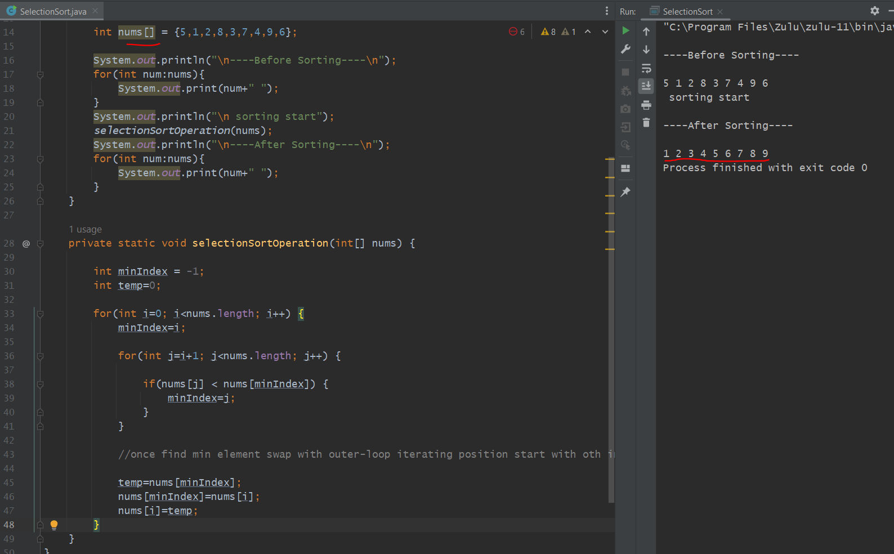

   ** If you want to see In Selection sort after each iteration how elements are traversing ...

 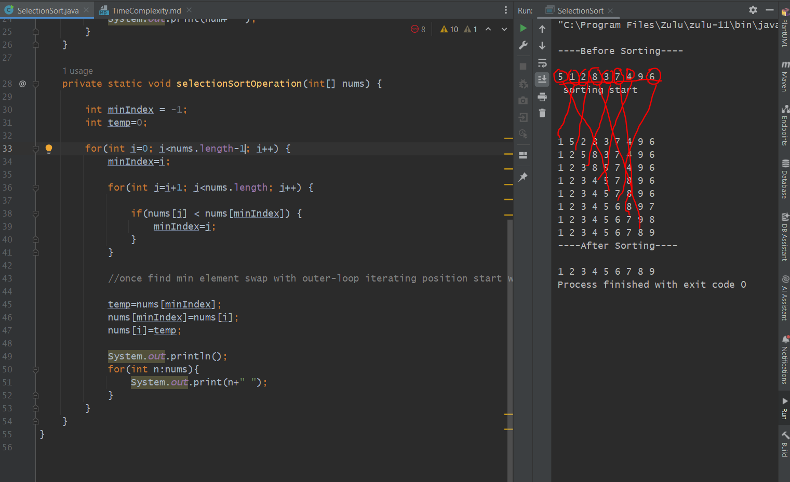

  last element even no need to sort so for n element no. of iteration req = n-1

    Element = n

    Required Iteration = n-1

  last element's already would be in a sorted position so iteration starts from i=0 to i<(nums.length-1)

      Basically You are trying to find a minimum value and swap it with the location where it should be.

Insertion Sort
===============

 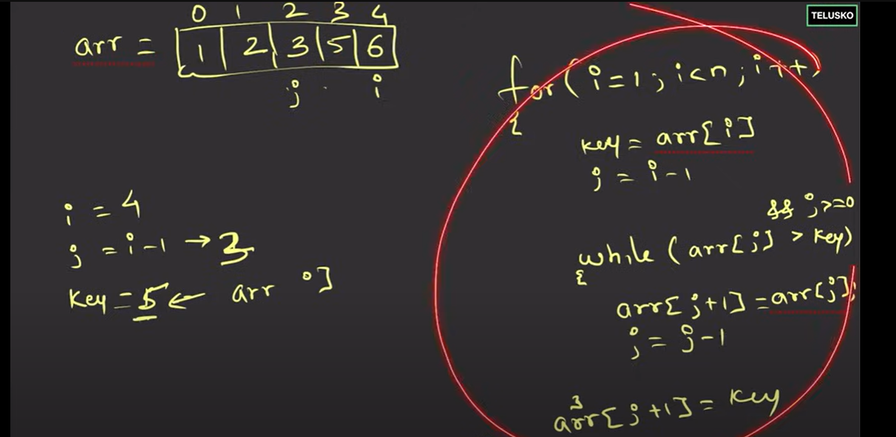

 

 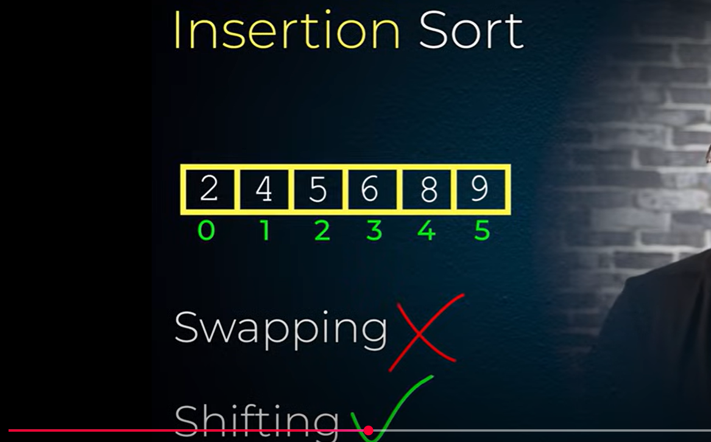

 

steps -

      Basically you take the elements and put the elements at right position. that's called insertion.

      In this you are not doing swapping what you doing is Shifting.
   
      Now you don't start from the first value you start from the second value and you assume your first value is already sorted.

      Basically you divide your array or list in 2 sigments one is sorted and another is unsorted.

      so as you take 2nd value and put into temp variable and start comparing with sorted array elements and start shifting sorted array element
 
      and once you find the right place so insert that temp variable in sorted array.

      so 2 loop....

      1st loop start traversing from 2nd elements...i =  1,2,3,4,5,6...

      and your second while loop will start from j = i-1 and it will go till j>-1 and 

      then it will compare temp variable with sorted elements if sorted elements is greater than
 
      it will shift right till get right temp variable place to insert. that's the overall logic.

   Time Complexity - O(n2)

Quick Sort
==========

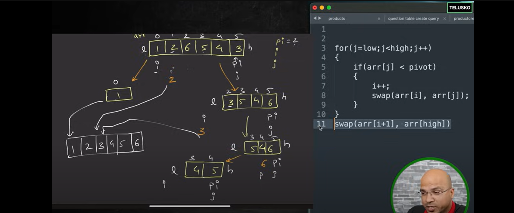

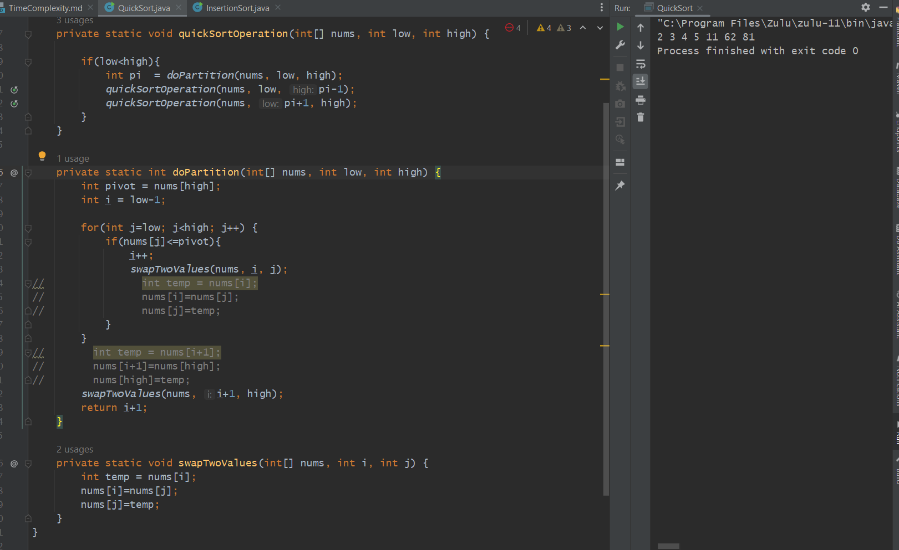

 Quick sort go for recursion.
  Time complexity ->

      Quick SOrt -> O(n logn)

         the reason is we are having 1 for loop i.e n
         and we are doing partitioned i.e log n  

         worst case might be O(n2)

  steps- 

      Take pivot as a last element
     
      now we need to move pivot at a specific position from where all left hand side of pivot should be lesser than pivot value
      and right side elements of pivot should be greater than pivot value.
     
      so we are doing partitioning based on pivot element.

      we took min and max position value

      we call recursion based on partition(pivot) position till min < max condition.

      partitioning -

         after partitioning we are returning pivot element which get a exact position where left side ele is lower and right side is higher. 
         taking pivot as a last element.
         we took one loop j to iterate from min to max value.
         we took variable i= min-1; i.e -1
         condition arr[j]<=pivot  -> i++ and swap(i,j) else do nothing and outer loop go j++ for next element.
         once iterate at end we need to swap(i+1, max) and need to return (i+1) after partition which is a new pivot value position.
         this process get call recursively.

      Time Complexity - O(nlogn)

  Overall Quick SOrt Idea is-

      Firstly we are deciding a pivot element and during partitioning at end we are moving
      our pivot element at a position where all left elements is lesser and right is higher.
      repeating the same process recursively after getting pivot using divide and conquer
      technique and at end combining all results.

   *** bubble sort/ selection sort/ insertion sort applying on a complete list.  

   *** But Quick Sort is apply based on divide and conquer technique. 

   *** Divide your problem into multiple things and solve the problems individually and at end just combine it.

Tracing Code
------------
      package com.practise.dsa.algo.sorting;

public class QuickSort {

    public static void main(String[] args) {

        int nums[] = {5, 62, 2, 3, 11, 81, 4};
        int low = 0;
        int high = nums.length-1;
        System.out.println("\nBefore Sorting\n");
        for (int i:nums){
            System.out.print(i+" ");
        }

        quickSortOperation(nums, low, high);

        System.out.println("\nAfter Sorting\n");
        for (int i:nums){
            System.out.print(i+" ");
        }
    }

    private static void quickSortOperation(int[] nums, int low, int high) {

        if(low<high){
            int pi  = doPartition(nums, low, high);
            quickSortOperation(nums, low, pi-1);
            quickSortOperation(nums, pi+1, high);
        }
    }

    private static int doPartition(int[] nums, int low, int high) {
        int pivot = nums[high];

        System.out.println("\n\n pivot - "+nums[high]+"\n");
        int i = low-1;

        for(int j=low; j<high; j++) {
            if(nums[j]<=pivot){
                i++;
                swapTwoValues(nums, i, j);
      //                int temp = nums[i];
      //                nums[i]=nums[j];
      //                nums[j]=temp;
      }
      }
      //        int temp = nums[i+1];
      //        nums[i+1]=nums[high];
      //        nums[high]=temp;
      swapTwoValues(nums, i+1, high);

        for(int k:nums){
            System.out.print(k+" ");
        }

        return i+1;
    }

    private static void swapTwoValues(int[] nums, int i, int j) {
        int temp = nums[i];
        nums[i]=nums[j];
        nums[j]=temp;
    } }

  Quick Sort Tracing Explanation steps ->
  ------------------------------------

      first time we took pivot as a last element 4
      min=0;
      max=length-1;
   
      -> input- 5 62 2 3 11 81 4     -> pivot- 4
   
      pivot= max  = 4
      i= min-1 = 0-1 = -1
      j=0 = 5 
      
      loop:  j=0; j<max; j++
   
      if(arr[j]<pivot) = 5 < 4 = false then j++;   j=5=62
   
      if(arr[j]<pivot) = 62 < 4 = false then j++;  j=62=2
   
      if(arr[j]<pivot) = 2 < 4 = true then i++ && swap(i,j); i=5 ; input: 2 62 5 3 11 81 4 then j++
      
      new input: 2 62 5 3 11 81 4     i=2, j=3
   
      if(arr[j]<pivot) = 3 < 4 = true then i++ && swap(i,j); i=62; input: 2 3 5 62 11 81 4 then j++
      
      new input: 2 3 5 62 11 81 4    i=3  j=11
   
      if(arr[j]<pivot) = 11<4 = false then j++;  j=11=81
   
      if(arr[j]<pivot) = 81<4 = false then j++;  j=81=4=pivot
      
         data - 2 3 5 62 11 81 4
   
      After 1 Iteration complete ->   i=3, j=4, pivot=4
      swap(i+1, high)

    data - 2 3 4 62 11 81 5   like this it will go so follow below screenshot.

  
   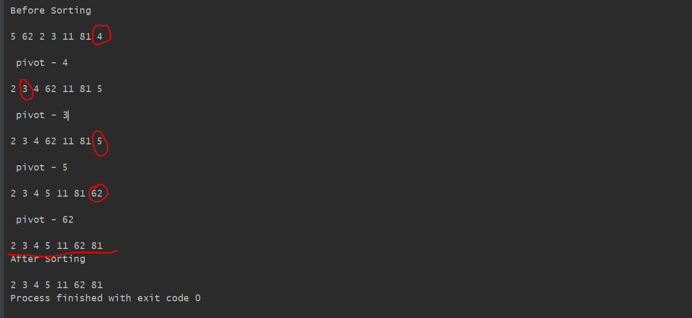

 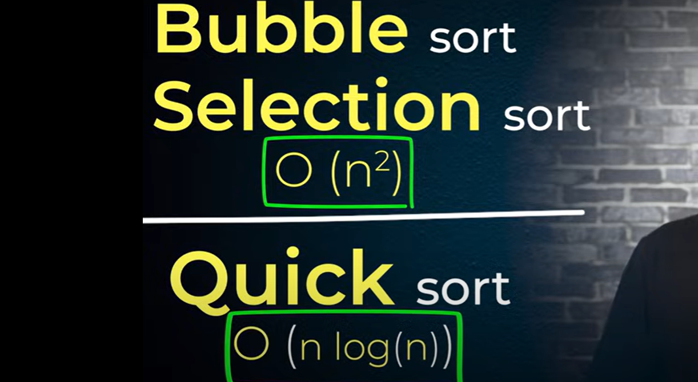

Duvide And Conquer
------------------

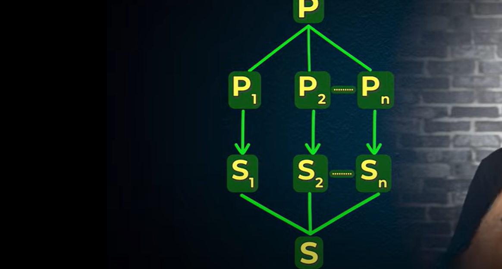

1 problem -> divide problems->  multiple solutions -> combine all solutions

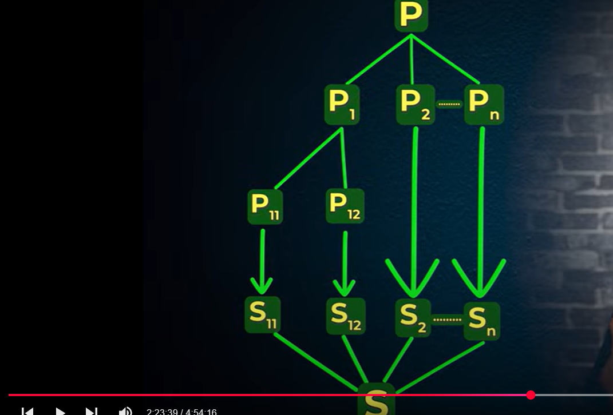

Recursion
==========

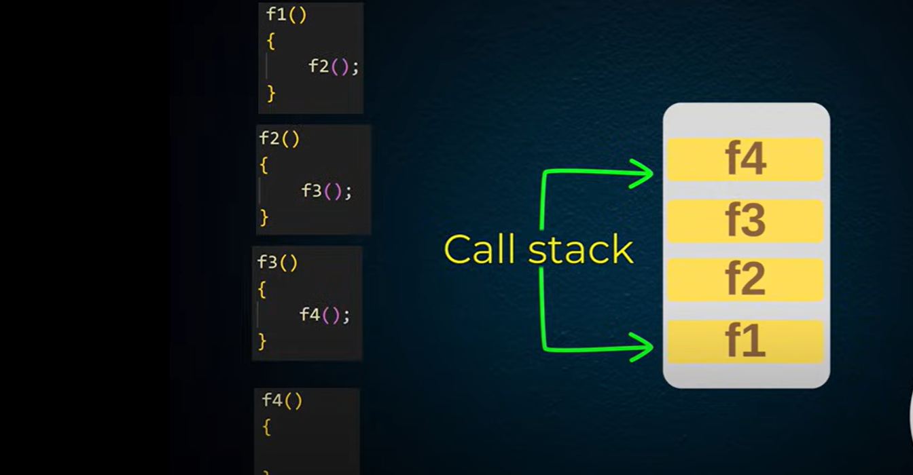

Recursion-A function calling itself.

** If you not applying a condition it's a never ending process and your
    system will throw stack overflow exception.

** 

Merge Sort  (Divide and Conquer)
================================   

=>  Both Quick and Merge Sort Follow Divide and Conquer

=>  You Break down the Problem into Sub Problems and apply the algorithm on those sub-problems.

=>  Once you Get the solution for each Sub-Problems then you combine a solution to get final solution.

=>  Both Quick and Merge Sort Time Complexity O ( n logn )

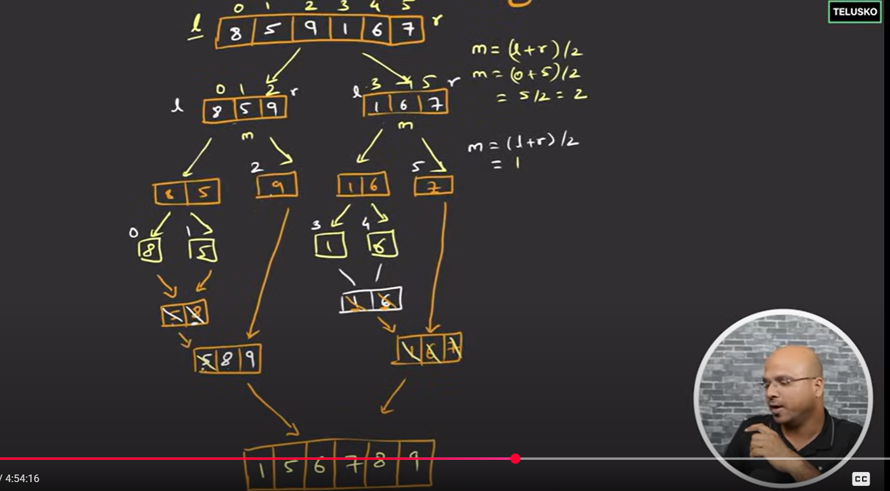

=> By Using this you will get the value divided we are calling merge but we have not defined the function yet.

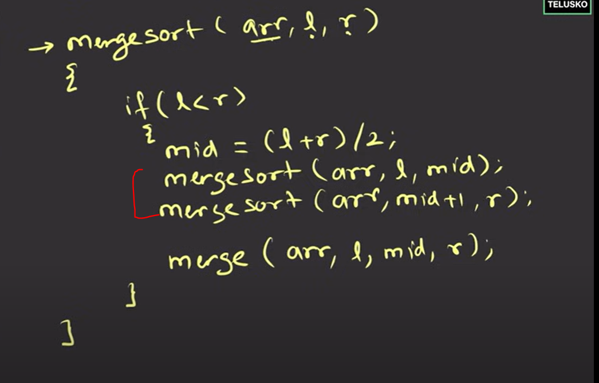

=> Let's see How we can do the merge bit complicated but bear with me...

=> In merge you are basically going to create 2 array's.
 
=> so every time when we call merge we need 2 array's will call them left and right array.

=> so both left and right arry is empty this time so we need to copy the element's from an actual array. 

=> After copied element's in both array we need to compare and combine an make a bigger array.

=> we can iterate left array using i, right array using j and bigger array with variable k.

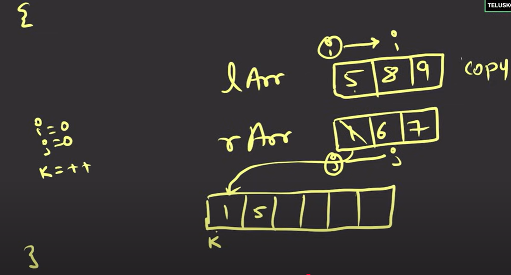

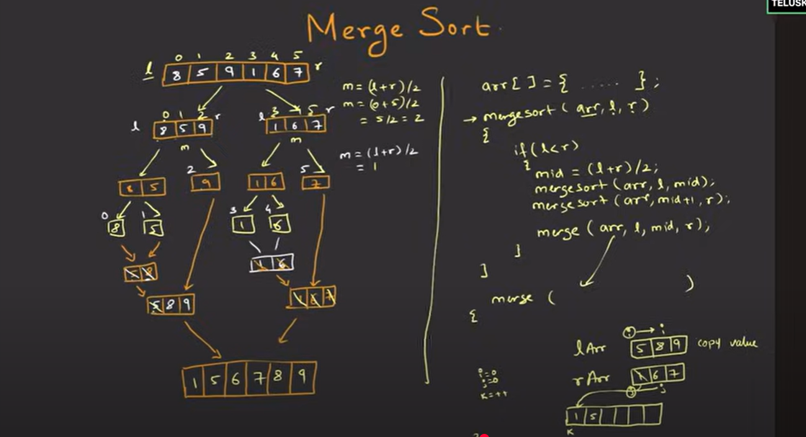

 *** For Merging 2 array Left and Right Array How we can decide the size of an array

        so, Left array It start's with l and ends with mid so if u say (mid-l) you will get the length right
            but the problem is since this is zero indexing you also need to add +1 i.e (mid-l+1) bcz mid is
            not representing the size of an array it represents the indexing. 

 *** next step is we need to copy the value in both left and right array from actual array.

 *** and then we need to merge both the array in a sorted order.

      

      

      

   

