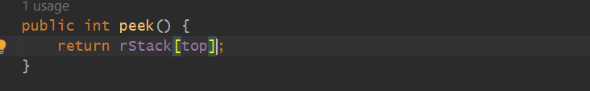

 
 
 ** we can use it to store data. the question is why it is different??
 
 LAST IN FIRST OUT (LIFO)
 
 

 

 
 Stack Memory is like having only one entry Point and same entry point we use yo Exit.
 
     => Last Element we entered will be the First Element to pick out just like stack of Books, Plates.
     
     => Two Operations - PUSH & POP
     
     => When You want insert Data - [Push], When You want take it out Data - [Pop]
     
     => When Stack become full, and you are trying to insert data it will give an error - [Stack Overflow]
     
     => When Stack is an EMPTY, and you are trying to fetch the data will give an error - [Stack Underflow]
     
     => [Peek] will give you the last value But it will not remove from the Stack.
     
     => So, If you just want to check then you can use [Peek].
     
     => But If you want to get the element out you can use [Pop].
     
     => If you want to Insert the data into a Stack you can use [Push].
     
     => Stack can be Implement Either using [Array] or using [Linked List].
    
     => [Advantage using Linked list over Array is the size bcz Linked list will expand. dynamically increases the size but
        the Drawback is it will be Bit Slow].
    
     => [top] - we are having one variable called [top] which will refer the last element index value we added in stack,
        By default we are taking top = -1 so we don't have any value yet.

    Stack - InBuild Methods in Java (push, pop, peek, add)
   
   

  Implementation - Stack using Array
  ----------------------------------

 
  

  

  

  

    public class Stack {

    int rStack[]=new int[5];
    int size;
    int top;

    Stack(){
        size=rStack.length;
        top=-1;
    }

    public void push(int data) {
        //first you will increment top bcz default is -1 and array store from index 0
        if(top < size-1){
            rStack[++top]=data;
        }else{
            System.out.println("Stack Overflow");
        }
    }

    public int pop() {

        return rStack[top--];
    }

    public void print() {
        for(int i:rStack){
            System.out.print(i+" ");
        }
    }

    public int peek() {
        return rStack[top];
    }
    }

Implementation - Stack using Linked List
----------------------------------------

  
  
  
  
  
  
  
  
  
  

      class Node
    {
      int data;
      Node next;

      public Node(int data) {
        this.data = data;
        next=null;
    }}

    public class Stack {

    Node head = null;

    public void push(int data) {

        Node newNode = new Node(data);
        if(isEMPTY()){
            head = newNode;
            return;
        }

        newNode.next=head;
        head=newNode;
    }

    public boolean isEMPTY() {
        return head==null;
    }

    public int pop() {

        if(isEMPTY()){
            return -1;
        }

        Node top=head;
        head=head.next;
        return top.data;
    }

    public int peek() {

        if(isEMPTY()){
            return -1;
        }

        Node top=head;
        return top.data;
    }
    }
